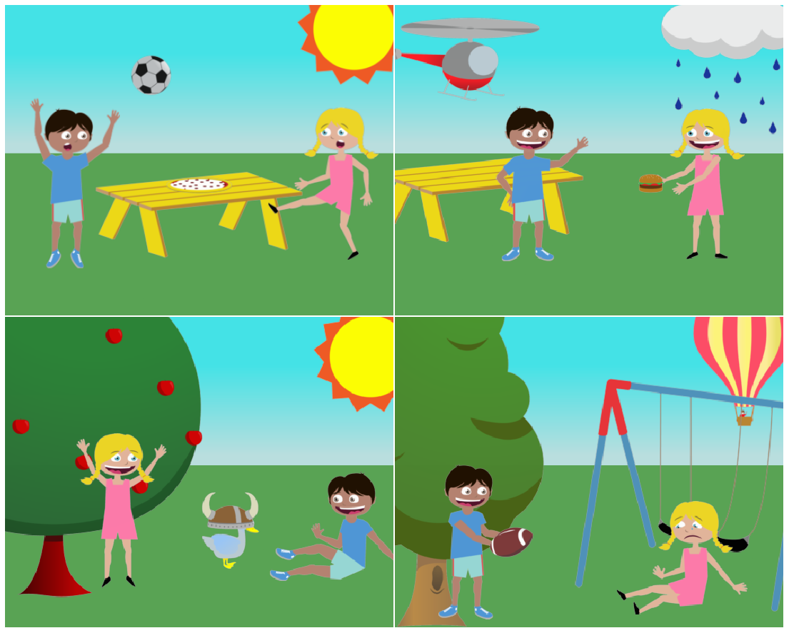

# Decoding language spatial relations to 2D spatial arrangements



This repository is the official implementation of [Decoding language spatial relations to 2D spatial arrangements](https://www.aclweb.org/anthology/2020.findings-emnlp.408/) (published at [Findings of EMNLP 2020](https://www.aclweb.org/anthology/volumes/2020.findings-emnlp/)) authored by [Gorjan Radevski](http://gorjanradevski.github.io/), [Guillem Collel](https://sites.google.com/site/guillemct1/), [Marie-Francine Moens](https://people.cs.kuleuven.be/~sien.moens/) and [Tinne Tuytelaars](https://homes.esat.kuleuven.be/~tuytelaa/).

## Requirements

If you are using [Poetry](https://python-poetry.org/), navigating to the project root directory and running `poetry install` will suffice. Otherwise, a `requirements.txt` file is present so you can install all dependencies by running `pip install -r requirements.txt`. However, if you just want to download the trained models or dataset splits, make sure to have [gdown](https://github.com/wkentaro/gdown) installed. If the project dependencies are installed then `gdown` is already present. Otherwise, run `pip install gdown` to install it.

## Downloading the datasets and the models

> All shell commands bellow asume that (1) the repository is cloned, (2) a virtual environment is created with Poetry, and (3) we're inside the project root.

The [Abstract Scenes Dataset](https://vision.ece.vt.edu/clipart/) can be downloaded and unzipped as:

```shell
wget https://vision.ece.vt.edu/clipart/dataset/AbstractScenes_v1.1.zip data/
unzip -qq data/AbstractScenes_v1.1.zip data/
```

Our proposed dataset split and the dictionaries that map from clip-art names to the clip-art indices can be downloaded and prepared as:

```shell
poetry run gdown --id 1qEsb8Hv0zSBbWLEoeRxFTFLak17DN8CD -O data/train_dataset.json
poetry run gdown --id 1P0LF_8ZXmMgfaIbX7n25SUWA9Hw66vuL -O data/val_dataset.json
poetry run gdown --id 13iYr6jckFpa42zXY_H3oRRv8gu4A7-fT -O data/test_dataset.json
poetry run gdown --id 1MwhnYXrr3kwo9RVrqfkU2vFD-XCZO-sW -O data/visual_dicts.zip
unzip -qq data/visual_dics.zip .
```

Some of the models used can be downloaded as:

```shell
poetry run gdown --id 1ZWmtRRSZ58qEdbE4u8ZmZ4L3FwF2vBfe -O models/discrete_15p.pt
poetry run gdown --id 1euOifmMe5PSJlv5z9s2AHeKaTL887yWH -O models/continuous_15p.pt
poetry run gdown --id 1qwr7Qzwn_kraQYMxmVu3z8yq5q0ooRsR -O models/cliparts_pred_tan.pt
poetry run gdown --id 1GNCpGxDn4abUpUff9AStMziGinsHC51r -O models/discrete_15p_tan.pt
```

## Training new models, running inference from a pre-trained checkpoint

> We assume that (1) we're inside the project root, (2) Poetry is installed, and (3) the datasets and the models are fetched.

### Training new models

A new Discrete model can be trained as:

```shell
poetry run python src/train_discrete.py --train_dataset_path "data/train_dataset.json"
                                        --val_dataset_path "data/val_dataset.json"
                                        --visual_dics_path "data/visual_dicts"
                                        --save_model_path "models/my_model.pt"
```

The remaining arguments can be left as is. For training a Continuous model, the same command line arguments can be used, and just the script `train_continuous.py` should the executed.

### Running inference

To get a quantitative estimate of how good a model is, e.g., replicating the results of Table 1 in the paper, we can do:

```shell
poetry run python src/inference.py --test_dataset_path "data/test_dataset.py"
                                   --visuals_dicts_path "data/visual_dicts_path/"
                                   --checkpoint_path "models/discrete_15p.pt"
                                   --model_type "discrete"
                                   --gen_strategy "models/highest_confidence_beam"
```

The remaining arguments can be left as is. The snippet above performs inference with a Discrete model. The same script `inference.py` should be run to perform inference with a Continuous model, however, `--model_type "continuous"` should be added together with a checkpoint corresponding to a Continuous model, e.g., `continuous_15p.pt`, and an appropriate decoding strategy should be used, e.g., `--gen_strategy "human_order"`.

### Generating visual scenes, i.e., performing qualitative evaluation

Have a look at the the Jupyter notebook `notebooks/discrete_model_generate_scene.ipynb`.

## Reference

If you found this code useful, or use some of our resources for your work, we will appreciate if you cite our paper.

```tex
@inproceedings{radevski-etal-2020-decoding,
    title = "Decoding language spatial relations to 2{D} spatial arrangements",
    author = "Radevski, Gorjan  and
      Collell, Guillem  and
      Moens, Marie-Francine  and
      Tuytelaars, Tinne",
    booktitle = "Proceedings of the 2020 Conference on Empirical Methods in Natural Language Processing: Findings",
    month = nov,
    year = "2020",
    address = "Online",
    publisher = "Association for Computational Linguistics",
    url = "https://www.aclweb.org/anthology/2020.findings-emnlp.408",
    pages = "4549--4560",
    abstract = "We address the problem of multimodal spatial understanding by decoding a set of language-expressed spatial relations to a set of 2D spatial arrangements in a multi-object and multi-relationship setting. We frame the task as arranging a scene of clip-arts given a textual description. We propose a simple and effective model architecture Spatial-Reasoning Bert (SR-Bert), trained to decode text to 2D spatial arrangements in a non-autoregressive manner. SR-Bert can decode both explicit and implicit language to 2D spatial arrangements, generalizes to out-of-sample data to a reasonable extent and can generate complete abstract scenes if paired with a clip-arts predictor. Finally, we qualitatively evaluate our method with a user study, validating that our generated spatial arrangements align with human expectation.",
}
```

## License

Everything is licensed under the [MIT License](https://opensource.org/licenses/MIT).

## Acknowledgements

We acknowledge funding from the Flemish Government under the Onderzoeksprogramma Artificiele Intelligentie (AI) Vlaanderen programme. This work has also been supported by the CHIST-ERA EU project [MUSTER](http://9www.chistera.eu/projects/muster).